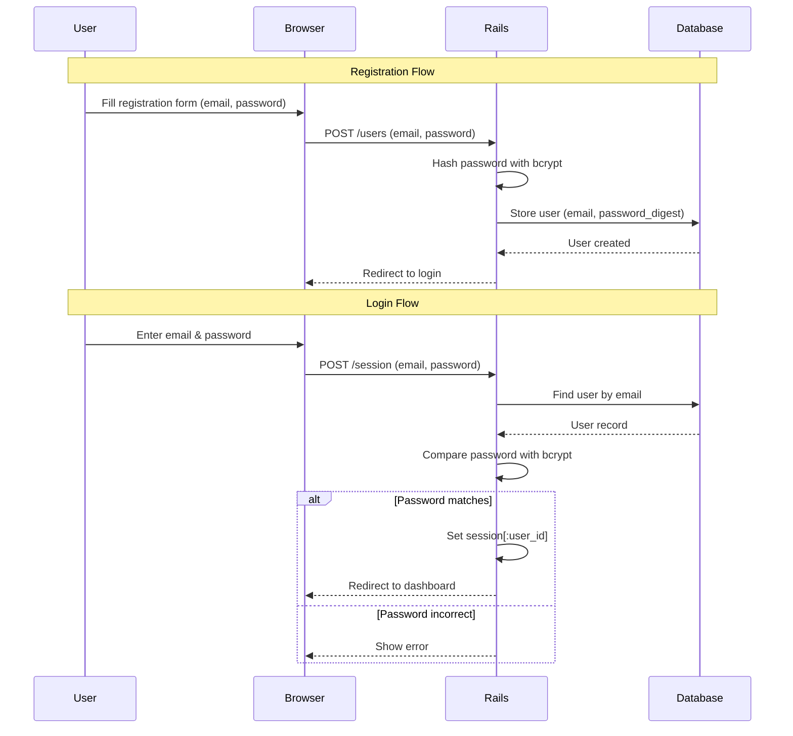
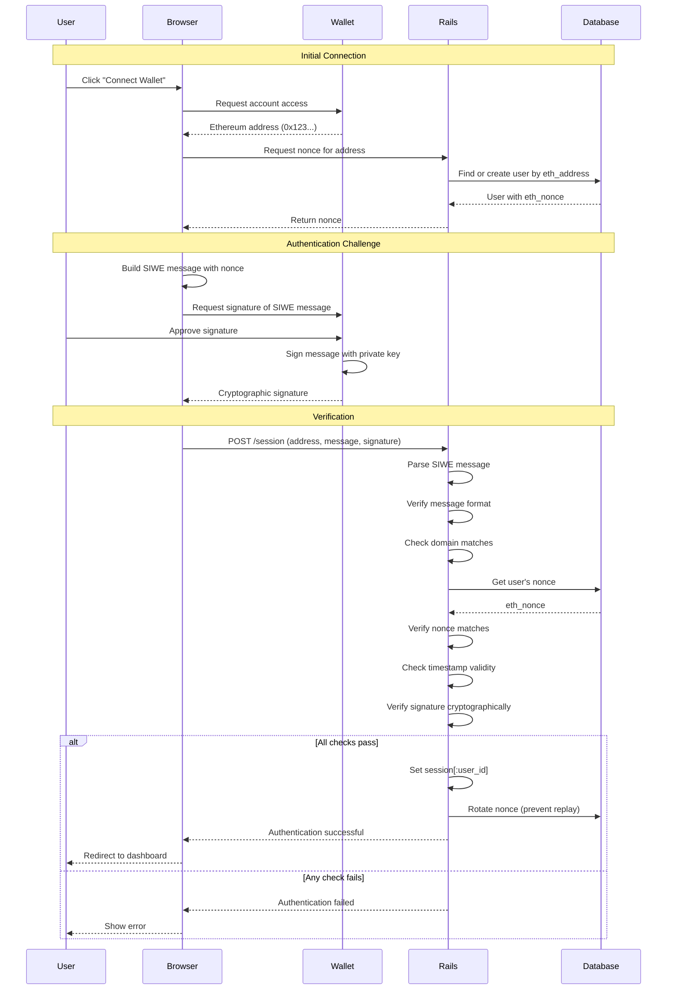
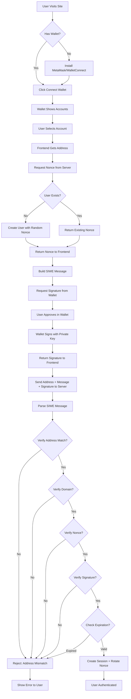
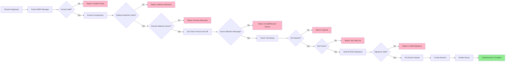

# SIWE Authentication Algorithm Documentation

## Table of Contents
1. [Overview](#overview)
2. [Traditional Rails Authentication](#traditional-rails-authentication)
3. [SIWE Authentication Flow](#siwe-authentication-flow)
4. [Detailed Algorithm Description](#detailed-algorithm-description)
5. [Security Considerations](#security-considerations)
6. [Comparison Table](#comparison-table)

## Overview

This document describes the Sign-In With Ethereum (SIWE) authentication mechanism implemented in this Rails application. SIWE is a passwordless authentication protocol that uses cryptographic signatures from Ethereum wallets to verify user identity.

**Key Concept**: Instead of storing and validating passwords, we verify that users own the private key associated with their Ethereum address by asking them to sign a challenge message.

## Traditional Rails Authentication

For context, here's how traditional password-based authentication works in Rails:



**Problems with password-based auth:**
- Users must remember passwords
- Passwords can be weak or reused
- Risk of database breaches exposing password hashes
- Need password reset mechanisms
- Requires secure password storage (bcrypt, etc.)

## SIWE Authentication Flow

SIWE eliminates passwords entirely by leveraging Ethereum's public-key cryptography:



## Detailed Algorithm Description

### Phase 1: Wallet Connection & Nonce Generation

**Client Side (JavaScript):**
```javascript
// 1. Request wallet connection
const accounts = await ethereum.request({
  method: 'eth_requestAccounts'
});
const address = accounts[0]; // e.g., "0x742d35Cc6634C0532925a3b844Bc9e7595f0bEb"
```

**Server Side (Rails):**
```ruby
# SessionsController#create - load_user callback
def load_user
  @address = params[:eth_address].to_s.downcase

  # Find existing user or create new one
  @user = User.find_or_create_by(eth_address: @address) do |u|
    u.eth_nonce = Siwe::Util.generate_nonce  # Random 8+ character string
  end
end
```

**Why nonce?**
- Prevents replay attacks (same signature can't be reused)
- Unique for each authentication attempt
- Rotated after successful login

### Phase 2: SIWE Message Construction

The SIWE message follows [EIP-4361 specification](https://eips.ethereum.org/EIPS/eip-4361):

```
example.com wants you to sign in with your Ethereum account:
0x742d35Cc6634C0532925a3b844Bc9e7595f0bEb

Sign in to Example App

URI: https://example.com
Version: 1
Chain ID: 1
Nonce: YqnKjNL8pREgNv8s
Issued At: 2025-12-27T10:30:00Z
Expiration Time: 2025-12-27T11:30:00Z
```

**Client Side:**
```javascript
// 2. Build SIWE message
const message = new SiweMessage({
  domain: window.location.host,
  address: address,
  statement: "Sign in to Blockchain Auth",
  uri: window.location.origin,
  version: '1',
  chainId: 1,
  nonce: nonceFromServer,  // Received from Rails
  issuedAt: new Date().toISOString(),
  expirationTime: new Date(Date.now() + 3600000).toISOString() // 1 hour
});

const messageString = message.prepareMessage();
```

### Phase 3: Cryptographic Signature

**Client Side:**
```javascript
// 3. Request signature from wallet
const signature = await ethereum.request({
  method: 'personal_sign',
  params: [messageString, address]
});
// signature: "0x1a2b3c4d..." (130 characters, ECDSA signature)
```

**What happens in the wallet:**
1. User sees human-readable message
2. User clicks "Sign" (not a blockchain transaction - gas-free!)
3. Wallet uses private key to create ECDSA signature
4. Signature proves: "The owner of this address signed this exact message"

### Phase 4: Server-Side Verification

**Server Side (Rails):**
```ruby
# SessionsController#verify_siwe!
def verify_siwe!(message:, signature:, address:, user:)
  # Parse the SIWE message string into structured data
  siwe = Siwe::Message.from_message(message)

  # 1. Verify address matches
  return false unless siwe.address.to_s.downcase == address

  # 2. Prepare verification parameters
  expected_domain = request.host_with_port  # e.g., "localhost:3000"
  expected_nonce = user.eth_nonce           # From database
  now_utc = Time.current.utc.iso8601

  # 3. Comprehensive verification (throws exceptions on failure)
  siwe.verify(signature, expected_domain, now_utc, expected_nonce)
  # This method checks:
  # - Signature is cryptographically valid (ECDSA recovery)
  # - Domain matches current host
  # - Nonce matches user's stored nonce
  # - Timestamp is within valid range (not expired, not future)
  # - Message format follows EIP-4361 spec

  return true
rescue Siwe::ExpiredMessage
  # Token expired (expirationTime passed)
  false
rescue Siwe::InvalidSignature
  # Signature doesn't match (wrong private key or tampered message)
  false
rescue Siwe::NonceMismatch
  # Nonce doesn't match (replay attack or wrong user)
  false
# ... handle other exceptions
end
```

**Cryptographic Verification Details:**

The `siwe.verify` method performs ECDSA signature verification:

```ruby
# Pseudocode of what happens inside the siwe gem:
def verify(signature, domain, timestamp, nonce)
  # 1. Recover public key from signature
  public_key = recover_public_key_from_signature(signature, message)

  # 2. Derive Ethereum address from public key
  derived_address = keccak256(public_key)[12..31]  # Last 20 bytes

  # 3. Compare with claimed address
  raise InvalidSignature unless derived_address == self.address

  # 4. Verify domain, nonce, timestamp
  raise DomainMismatch unless self.domain == domain
  raise NonceMismatch unless self.nonce == nonce
  raise ExpiredMessage if Time.parse(self.expirationTime) < timestamp
  # ... more checks
end
```

### Phase 5: Session Creation & Nonce Rotation

**Server Side:**
```ruby
def sign_in_user(user)
  # 1. Create session (standard Rails session)
  session[:user_id] = user.id

  # 2. CRITICAL: Rotate nonce to prevent replay attacks
  user.rotate_nonce!
  # This generates a NEW random nonce and saves it
  # Old signature is now invalid for future login attempts

  redirect_to root_path, notice: "Signed in"
end
```

**Why rotate nonce?**
- Without rotation, an attacker who intercepts the signature could reuse it
- Each nonce is single-use only
- Even if old signatures leak, they're useless

## Security Considerations

### 1. **Replay Attack Prevention**
- **Problem**: Attacker intercepts valid signature and tries to reuse it
- **Solution**: Nonce rotation after each successful login
- **Implementation**: `user.rotate_nonce!` in `sign_in_user`

### 2. **Man-in-the-Middle (MITM) Protection**
- **Problem**: Attacker modifies SIWE message in transit
- **Solution**: Message is signed; any modification invalidates signature
- **Implementation**: Cryptographic signature verification

### 3. **Domain Binding**
- **Problem**: Signature from site A used on site B (cross-site attack)
- **Solution**: Domain is part of signed message
- **Implementation**: `expected_domain = request.host_with_port` check

### 4. **Time-based Attacks**
- **Problem**: Old signatures used days/weeks later
- **Solution**: Expiration time in SIWE message
- **Implementation**: `ExpiredMessage` exception handling

### 5. **Nonce Prediction**
- **Problem**: Attacker predicts next nonce
- **Solution**: Cryptographically random nonce generation
- **Implementation**: `Siwe::Util.generate_nonce` (random 8+ chars)

### 6. **Address Case Sensitivity**
- **Problem**: Ethereum addresses are case-insensitive, but string comparison isn't
- **Solution**: Normalize to lowercase before comparison
- **Implementation**: `eth_address.downcase` everywhere

## Comparison Table

| Aspect | Traditional Password Auth | SIWE Authentication |
|--------|---------------------------|---------------------|
| **User Secret** | Password (memorized) | Private key (in wallet) |
| **Server Stores** | Password hash (bcrypt) | Ethereum address + nonce |
| **Authentication** | Compare password hash | Verify cryptographic signature |
| **Credentials** | Username + Password | Ethereum address + Signature |
| **Password Reset** | Email recovery needed | Not applicable (no password) |
| **Phishing Risk** | High (users enter password) | Low (signature is site-specific) |
| **Database Breach Impact** | Hashes can be cracked | Addresses are public anyway |
| **User Experience** | Type password each time | One click in wallet |
| **Registration** | Email + Password form | Connect wallet (instant) |
| **Multi-factor** | Needs separate setup | Wallet itself is 2FA |
| **Lost Credentials** | Password reset flow | Lose wallet = lose access* |
| **Crypto Knowledge** | Not required | Must have wallet |

\* *Users should backup their wallet seed phrase*

## Flow Diagrams

### Complete Authentication Sequence



### Verification Process Detail



## Code References

Key files implementing this algorithm:

- **SessionsController** (`app/controllers/sessions_controller.rb`): Main authentication logic
- **User Model** (`app/models/user.rb`): Nonce management and address validation
- **Application Controller** (`app/controllers/application_controller.rb`): Session helpers
- **Routes** (`config/routes.rb`): Authentication endpoints

## Additional Resources

- [EIP-4361: Sign-In with Ethereum](https://eips.ethereum.org/EIPS/eip-4361)
- [SIWE Ruby Gem Documentation](https://github.com/spruceid/siwe-ruby)
- [Ethereum Signature Verification](https://docs.ethers.org/v5/api/signer/#Signer-signMessage)
- [ECDSA Signatures Explained](https://cryptobook.nakov.com/digital-signatures/ecdsa-sign-verify-messages)

---

**Last Updated**: December 27, 2025
**Version**: 1.0
