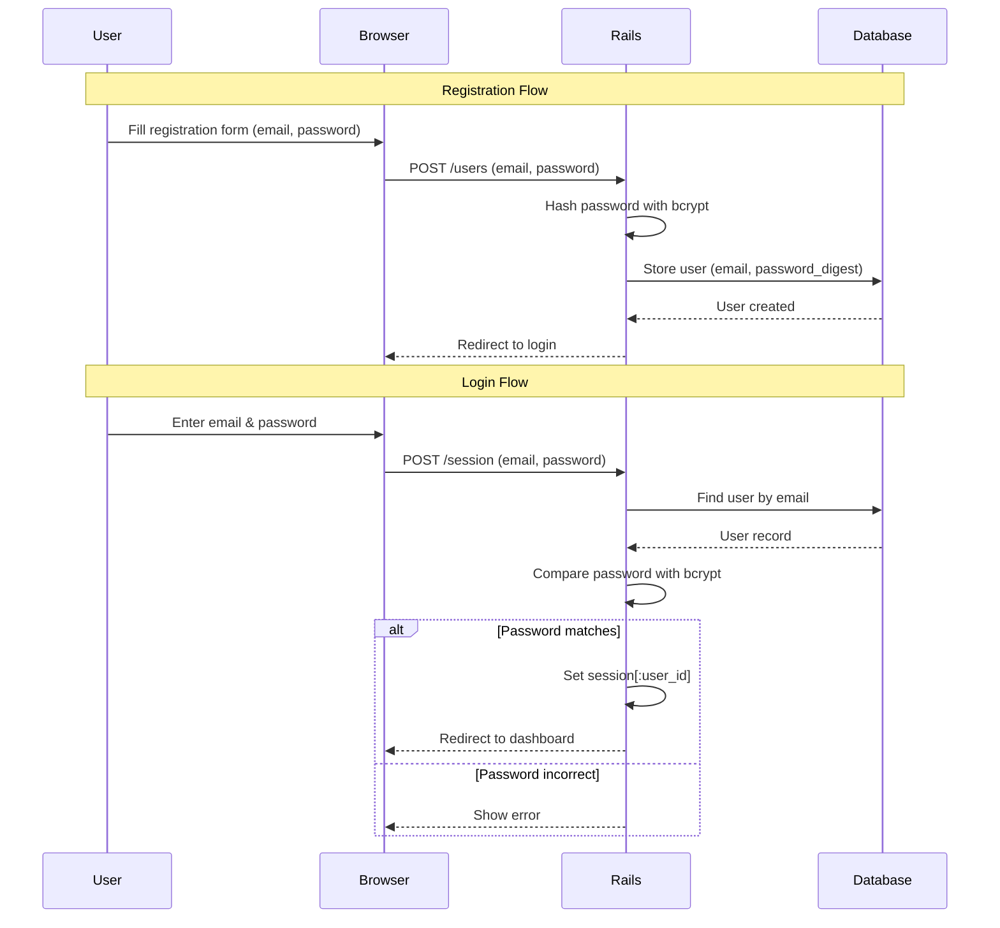
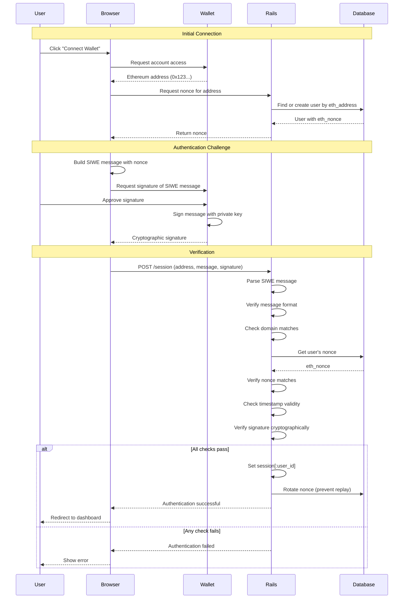
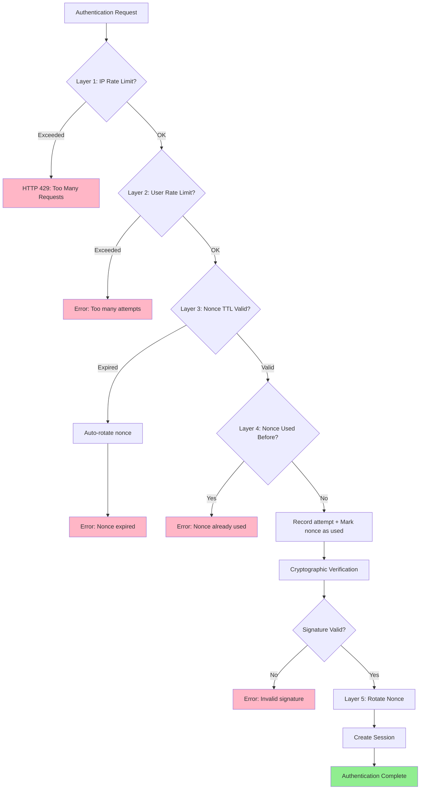
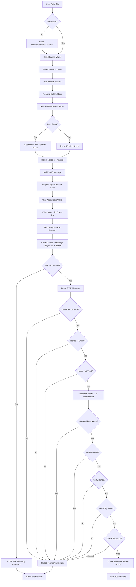

# SIWE Authentication Algorithm Documentation

## Table of Contents
1. [Overview](#overview)
2. [Traditional Rails Authentication](#traditional-rails-authentication)
3. [SIWE Authentication Flow](#siwe-authentication-flow)
4. [Detailed Algorithm Description](#detailed-algorithm-description)
5. [Multi-Layer Security System](#multi-layer-security-system)
6. [Security Considerations](#security-considerations)
7. [Comparison Table](#comparison-table)

## Overview

This document describes the Sign-In With Ethereum (SIWE) authentication mechanism implemented in this Rails application. SIWE is a passwordless authentication protocol that uses cryptographic signatures from Ethereum wallets to verify user identity.

**Key Concept**: Instead of storing and validating passwords, we verify that users own the private key associated with their Ethereum address by asking them to sign a challenge message.

## Traditional Rails Authentication

For context, here's how traditional password-based authentication works in Rails:



**Problems with password-based auth:**
- Users must remember passwords
- Passwords can be weak or reused
- Risk of database breaches exposing password hashes
- Need password reset mechanisms
- Requires secure password storage (bcrypt, etc.)

## SIWE Authentication Flow

SIWE eliminates passwords entirely by leveraging Ethereum's public-key cryptography:



## Detailed Algorithm Description

### Phase 1: Wallet Connection & Nonce Generation

**Client Side (JavaScript):**
```javascript
// 1. Request wallet connection
const accounts = await ethereum.request({
  method: 'eth_requestAccounts'
});
const address = accounts[0]; // e.g., "0x742d35Cc6634C0532925a3b844Bc9e7595f0bEb"

// 2. Request nonce from server (does NOT create User)
const response = await fetch(`/api/v1/users/${address.toLowerCase()}`);
const data = await response.json();
const nonce = data.eth_nonce; // Stored in cache, not database
```

**Server Side (Rails):**
```ruby
# Api::V1::UsersController#show
def show
  address = params[:eth_address].to_s.downcase

  # Generate nonce and store in cache (NOT in database)
  nonce = SecureRandom.hex(16)
  cache_key = "siwe_nonce:#{address}"

  # Store with 10 minute TTL (auto-expiration)
  Rails.cache.write(cache_key, nonce, expires_in: 10.minutes)

  render json: { eth_nonce: nonce }
end
```

**Why nonce?**
- Prevents replay attacks (same signature can't be reused)
- Unique for each authentication attempt
- Auto-expires in cache (10 minutes TTL)
- **No User record created** until successful verification

### Phase 2: SIWE Message Construction

The SIWE message follows [EIP-4361 specification](https://eips.ethereum.org/EIPS/eip-4361):

```
example.com wants you to sign in with your Ethereum account:
0x742d35Cc6634C0532925a3b844Bc9e7595f0bEb

Sign in to Example App

URI: https://example.com
Version: 1
Chain ID: 1
Nonce: YqnKjNL8pREgNv8s
Issued At: 2025-12-27T10:30:00Z
Expiration Time: 2025-12-27T11:30:00Z
```

**Client Side:**
```javascript
// 2. Build SIWE message
const message = new SiweMessage({
  domain: window.location.host,
  address: address,
  statement: "Sign in to Blockchain Auth",
  uri: window.location.origin,
  version: '1',
  chainId: 1,
  nonce: nonceFromServer,  // Received from Rails
  issuedAt: new Date().toISOString(),
  expirationTime: new Date(Date.now() + 3600000).toISOString() // 1 hour
});

const messageString = message.prepareMessage();
```

### Phase 3: Cryptographic Signature

**Client Side:**
```javascript
// 3. Request signature from wallet
const signature = await ethereum.request({
  method: 'personal_sign',
  params: [messageString, address]
});
// signature: "0x1a2b3c4d..." (130 characters, ECDSA signature)
```

**What happens in the wallet:**
1. User sees human-readable message
2. User clicks "Sign" (not a blockchain transaction - gas-free!)
3. Wallet uses private key to create ECDSA signature
4. Signature proves: "The owner of this address signed this exact message"

### Phase 4: Security Checks & Verification

Before cryptographic verification, multiple security layers are checked:

**Server Side (Rails - SiweAuthenticationService):**
```ruby
# Security checks BEFORE signature verification (cache-based)
def perform_security_checks
  # 1. Check if nonce exists in cache
  cached_nonce = Rails.cache.read("siwe_nonce:#{eth_address}")
  unless cached_nonce
    @errors << "Nonce not found or expired. Please request a new one."
    return false
  end

  # 2. Check if nonce was already used (one-time use)
  if nonce_already_used?(cached_nonce)
    @errors << "Nonce already used. Please request a new one."
    return false
  end

  # 3. Parse SIWE message and verify nonce matches
  siwe = Siwe::Message.from_message(message)
  unless siwe.nonce == cached_nonce
    @errors << "Nonce mismatch. Please try again."
    return false
  end

  # 4. Mark nonce as used before verification (prevent concurrent attempts)
  mark_nonce_as_used(cached_nonce)
  true
end

# Cryptographic signature verification
def verify_signature
  # Parse the SIWE message string into structured data
  siwe = Siwe::Message.from_message(message)

  # 1. Verify address matches
  return false unless siwe.address.to_s.downcase == user.eth_address

  # 2. Comprehensive SIWE verification (throws exceptions on failure)
  siwe.verify(
    signature,
    request.host_with_port,  # Domain binding
    Time.current.utc.iso8601,  # Timestamp validation
    user.eth_nonce  # Nonce matching
  )
  # This method checks:
  # - Signature is cryptographically valid (ECDSA recovery)
  # - Domain matches current host
  # - Nonce matches user's stored nonce
  # - Timestamp is within valid range (not expired, not future)
  # - Message format follows EIP-4361 spec

  true
rescue Siwe::ExpiredMessage
  @errors << "Signature expired. Please sign a new message."
  false
rescue Siwe::InvalidSignature
  @errors << "Invalid signature. Please try signing again."
  false
rescue Siwe::NonceMismatch
  @errors << "Invalid nonce. Please refresh and request a new nonce."
  false
rescue Siwe::DomainMismatch
  @errors << "Domain mismatch. Please refresh and try again."
  false
# ... handle other exceptions
end
```

**Cryptographic Verification Details:**

The `siwe.verify` method performs ECDSA signature verification:

```ruby
# Pseudocode of what happens inside the siwe gem:
def verify(signature, domain, timestamp, nonce)
  # 1. Recover public key from signature
  public_key = recover_public_key_from_signature(signature, message)

  # 2. Derive Ethereum address from public key
  derived_address = keccak256(public_key)[12..31]  # Last 20 bytes

  # 3. Compare with claimed address
  raise InvalidSignature unless derived_address == self.address

  # 4. Verify domain, nonce, timestamp
  raise DomainMismatch unless self.domain == domain
  raise NonceMismatch unless self.nonce == nonce
  raise ExpiredMessage if Time.parse(self.expirationTime) < timestamp
  # ... more checks
end
```

### Phase 5: User Creation & Session Establishment

**Server Side:**
```ruby
# SiweAuthenticationService#authenticate
def authenticate
  return false unless perform_security_checks
  return false unless verify_signature

  # CRITICAL: Create User ONLY after successful verification
  @user = User.find_or_create_by!(eth_address: @eth_address)

  # Invalidate nonce (delete from cache)
  invalidate_nonce
  true
end

def invalidate_nonce
  # Remove nonce from cache after successful authentication
  Rails.cache.delete("siwe_nonce:#{@eth_address}")
  Rails.cache.delete("nonce_used:#{@eth_address}:#{@cached_nonce}")
end

# SessionsController#sign_in_user
def sign_in_user(user)
  session[:user_id] = user.id
  redirect_to wallet_path, notice: "Successfully signed in"
end
```

**Key differences from traditional approach:**
- User record created **ONLY after** successful signature verification
- No "phantom" unverified users in database
- Nonce invalidated by deleting from cache (not rotation)
- Old signature is invalid (nonce no longer exists in cache)

## Multi-Layer Security System

The application implements a comprehensive defense-in-depth strategy with cache-based security layers:

### Layer 1: IP-Based Rate Limiting

**Purpose**: Prevent brute-force attacks and DoS attempts at the network level

**Implementation**:
```ruby
# SessionsController
rate_limit to: 10, within: 1.minute, by: -> { request.remote_ip }, only: :create
```

**Details**:
- Limit: 10 authentication requests per minute per IP address
- Scope: IP-level (protects against distributed attacks)
- Technology: Rails 8 built-in rate limiter
- Action: Rejects requests with HTTP 429 (Too Many Requests)

**Why this matters**: SIWE signature verification is cryptographically expensive. This prevents attackers from overwhelming the server with verification requests.

### Layer 2: Nonce Endpoint Rate Limiting

**Purpose**: Prevent nonce farming and database spam attacks

**Implementation**:
```ruby
# Api::V1::UsersController
rate_limit to: 30, within: 1.minute, only: :show, by: -> {
  "#{request.remote_ip}:#{params[:eth_address].to_s.downcase}"
}
```

**Details**:
- Limit: 30 nonce requests per minute per IP:address combination
- Scope: Protects against both IP-level and address-level abuse
- Technology: Rails 8 built-in rate limiter with cache backend
- Action: Rejects requests with HTTP 429 (Too Many Requests)

**Why this matters**:
- Prevents attackers from flooding cache with nonces
- Stops database spam attempts (though users aren't created until verification)
- Each IP can request nonces for different addresses (legitimate multi-user scenarios)

### Layer 3: Nonce TTL (Time-To-Live)

**Purpose**: Limit the time window for replay attacks

**Implementation**:
```ruby
# Api::V1::UsersController#show
nonce = SecureRandom.hex(16)
cache_key = "siwe_nonce:#{address}"

# Auto-expiration via cache TTL
Rails.cache.write(cache_key, nonce, expires_in: 10.minutes)
```

**Details**:
- TTL: 10 minutes from nonce generation
- Storage: Rails.cache (Solid Cache in production, PostgreSQL-backed)
- Behavior: Automatic expiration (no manual cleanup needed)
- Verification: Nonce lookup fails if expired

**Security benefit**:
- Even if an attacker intercepts a valid signature, they only have a 10-minute window to use it
- No database pollution (nonces auto-expire in cache)
- No cron jobs needed for cleanup

### Layer 4: One-Time Nonce Usage

**Purpose**: Prevent replay attacks by ensuring each nonce is used only once

**Implementation**:
```ruby
# SiweAuthenticationService
def nonce_already_used?(nonce)
  Rails.cache.read(nonce_used_cache_key(nonce)).present?
rescue
  false  # Graceful degradation if cache unavailable
end

def mark_nonce_as_used(nonce)
  Rails.cache.write(nonce_used_cache_key(nonce), true, expires_in: 10.minutes)
rescue => e
  Rails.logger.warn("Cache unavailable for nonce marking: #{e.message}")
end

def nonce_used_cache_key(nonce)
  "nonce_used:#{@eth_address}:#{nonce}"
end
```

**Details**:
- Storage: Rails.cache (Solid Cache in production)
- Cache key: `"nonce_used:{eth_address}:{nonce}"`
- Expiration: Automatically expires after 10 minutes
- Fallback: Graceful degradation if cache is unavailable
- Checked BEFORE signature verification (early exit)

**Attack scenario prevented**:
1. Attacker intercepts valid signature
2. Legitimate user successfully authenticates (nonce marked as used + invalidated)
3. Attacker attempts to use intercepted signature
4. Layer 4 detects nonce was already used → reject immediately
5. Even if Layer 4 fails, nonce invalidation (Layer 5) ensures rejection

### Layer 5: Nonce Invalidation After Authentication

**Purpose**: Invalidate nonces immediately after successful authentication

**Implementation**:
```ruby
# SiweAuthenticationService#invalidate_nonce
def invalidate_nonce
  # Remove nonce from cache after successful authentication
  Rails.cache.delete("siwe_nonce:#{@eth_address}")
  Rails.cache.delete("nonce_used:#{@eth_address}:#{@cached_nonce}")
end
```

**Details**:
- Trigger: Immediately after successful verification and user creation
- Action: Delete nonce and usage marker from cache
- Security: Old signature becomes permanently invalid
- No database writes needed

**Why this is critical**: Even if an attacker somehow bypasses one-time usage check, the deleted nonce ensures any retry will fail at nonce lookup (Layer 3).

### Security Layers Interaction



### Security Configuration Constants

All security parameters are defined in respective controllers and services:

```ruby
# SiweAuthenticationService
NONCE_TTL = 10.minutes  # Layer 3: Cache TTL for nonces

# SessionsController
rate_limit to: 10, within: 1.minute  # Layer 1: IP-based auth limit

# Api::V1::UsersController
rate_limit to: 30, within: 1.minute  # Layer 2: Nonce endpoint limit
```

### Attack Scenarios & Mitigations

| Attack Scenario | Without Protection | With Cache-Based Security |
|----------------|-------------------|--------------------------|
| **Brute Force** | Attacker tries thousands of signatures | Layer 1 (IP: 10/min) + Layer 2 (nonce: 30/min) rate limits |
| **Replay Attack** | Old signature works forever | Layer 4 (one-time use) + Layer 5 (invalidation) prevent reuse |
| **Time-based Replay** | Signature valid indefinitely | Layer 3 (TTL) limits window to 10 minutes (auto-expire) |
| **DoS via Crypto** | Expensive ECDSA operations overwhelm server | Layer 1 (IP limit) prevents before reaching crypto code |
| **Database Spam** | Attacker creates millions of phantom users | No phantom users created (verification required first) |
| **Nonce Farming** | Attacker floods system with nonce requests | Layer 2 (30/min per IP:address) + cache TTL (auto-cleanup) |

## Security Considerations

### 1. **Replay Attack Prevention**
- **Problem**: Attacker intercepts valid signature and tries to reuse it
- **Solution**: Nonce rotation after each successful login
- **Implementation**: `user.rotate_nonce!` in `sign_in_user`

### 2. **Man-in-the-Middle (MITM) Protection**
- **Problem**: Attacker modifies SIWE message in transit
- **Solution**: Message is signed; any modification invalidates signature
- **Implementation**: Cryptographic signature verification

### 3. **Domain Binding**
- **Problem**: Signature from site A used on site B (cross-site attack)
- **Solution**: Domain is part of signed message
- **Implementation**: `expected_domain = request.host_with_port` check

### 4. **Time-based Attacks**
- **Problem**: Old signatures used days/weeks later
- **Solution**: Expiration time in SIWE message
- **Implementation**: `ExpiredMessage` exception handling

### 5. **Nonce Prediction**
- **Problem**: Attacker predicts next nonce
- **Solution**: Cryptographically random nonce generation
- **Implementation**: `Siwe::Util.generate_nonce` (random 8+ chars)

### 6. **Address Case Sensitivity**
- **Problem**: Ethereum addresses are case-insensitive, but string comparison isn't
- **Solution**: Normalize to lowercase before comparison
- **Implementation**: `eth_address.downcase` everywhere

## Comparison Table

| Aspect | Traditional Password Auth | SIWE Authentication |
|--------|---------------------------|---------------------|
| **User Secret** | Password (memorized) | Private key (in wallet) |
| **Server Stores** | Password hash (bcrypt) | Ethereum address + nonce |
| **Authentication** | Compare password hash | Verify cryptographic signature |
| **Credentials** | Username + Password | Ethereum address + Signature |
| **Password Reset** | Email recovery needed | Not applicable (no password) |
| **Phishing Risk** | High (users enter password) | Low (signature is site-specific) |
| **Database Breach Impact** | Hashes can be cracked | Addresses are public anyway |
| **User Experience** | Type password each time | One click in wallet |
| **Registration** | Email + Password form | Connect wallet (instant) |
| **Multi-factor** | Needs separate setup | Wallet itself is 2FA |
| **Lost Credentials** | Password reset flow | Lose wallet = lose access* |
| **Crypto Knowledge** | Not required | Must have wallet |

\* *Users should backup their wallet seed phrase*

## Flow Diagrams

### Complete Authentication Sequence



### Verification Process Detail

```mermaid
flowchart LR
    A[Receive Signature] --> SEC1{IP Rate Limit OK?}
    SEC1 -->|No| FAIL0[HTTP 429: Too Many Requests]
    SEC1 -->|Yes| SEC2{User Rate Limit OK?}

    SEC2 -->|No| FAIL_SEC1[Reject: Too many attempts]
    SEC2 -->|Yes| SEC3{Nonce TTL Valid?}

    SEC3 -->|No| FAIL_SEC2[Reject: Nonce expired]
    SEC3 -->|Yes| SEC4{Nonce Not Used?}

    SEC4 -->|No| FAIL_SEC3[Reject: Nonce already used]
    SEC4 -->|Yes| SEC5[Record Attempt + Mark Nonce Used]

    SEC5 --> B[Parse SIWE Message]
    B --> C{Format Valid?}
    C -->|No| FAIL1[Reject: Invalid Format]
    C -->|Yes| D[Extract Components]

    D --> E{Address Matches Claim?}
    E -->|No| FAIL2[Reject: Address Mismatch]
    E -->|Yes| F{Domain Matches Server?}

    F -->|No| FAIL3[Reject: Domain Mismatch]
    F -->|Yes| G[Get User's Nonce from DB]

    G --> H{Nonce Matches Message?}
    H -->|No| FAIL4[Reject: Invalid/Reused Nonce]
    H -->|Yes| I[Check Timestamp]

    I --> J{Not Expired?}
    J -->|No| FAIL5[Reject: Expired]
    J -->|Yes| K{Not Future?}

    K -->|No| FAIL6[Reject: Not Valid Yet]
    K -->|Yes| L[Verify ECDSA Signature]

    L --> M{Signature Valid?}
    M -->|No| FAIL7[Reject: Invalid Signature]
    M -->|Yes| N[All Checks Passed]

    N --> O[Create Session]
    O --> P[Rotate Nonce]
    P --> SUCCESS[Authentication Complete]

    style SUCCESS fill:#90EE90
    style FAIL0 fill:#FFB6C6
    style FAIL_SEC1 fill:#FFB6C6
    style FAIL_SEC2 fill:#FFB6C6
    style FAIL_SEC3 fill:#FFB6C6
    style FAIL1 fill:#FFB6C6
    style FAIL2 fill:#FFB6C6
    style FAIL3 fill:#FFB6C6
    style FAIL4 fill:#FFB6C6
    style FAIL5 fill:#FFB6C6
    style FAIL6 fill:#FFB6C6
    style FAIL7 fill:#FFB6C6
```



## Code References

Key files implementing this algorithm:

- **SessionsController** (`app/controllers/sessions_controller.rb`): Main authentication logic, IP-based rate limiting
- **SiweAuthenticationService** (`app/services/siwe_authentication_service.rb`): Cache-based security checks and SIWE verification
- **Api::V1::UsersController** (`app/controllers/api/v1/users_controller.rb`): Nonce generation and endpoint rate limiting
- **User Model** (`app/models/user.rb`): Minimal model with address validation only
- **Application Controller** (`app/controllers/application_controller.rb`): Session helpers
- **Routes** (`config/routes.rb`): Authentication endpoints

**Removed files (cache-based approach):**
- ~~Authenticatable Concern~~ - Security logic moved to SiweAuthenticationService
- ~~Maintenance Tasks~~ - No cleanup needed (cache auto-expires)
- ~~Cron Schedule~~ - No scheduled tasks required

## Additional Resources

- [EIP-4361: Sign-In with Ethereum](https://eips.ethereum.org/EIPS/eip-4361)
- [SIWE Ruby Gem Documentation](https://github.com/spruceid/siwe-ruby)
- [Ethereum Signature Verification](https://docs.ethers.org/v5/api/signer/#Signer-signMessage)
- [ECDSA Signatures Explained](https://cryptobook.nakov.com/digital-signatures/ecdsa-sign-verify-messages)

---

**Last Updated**: December 28, 2025
**Version**: 3.0 - Cache-based implementation (removed DB-based nonce storage, phantom users, and cron tasks)
